<!-- section:banner -->

  

  
  
  

  

<!-- end:banner -->

---

<!-- section:about -->
## 👨‍💻 About Me

> **Full-Stack Developer**
>
> 聚焦跨平台桌面应用与视频处理工具链的开源开发。
> 技术栈以 **Rust**、**TypeScript**、**Python** 为核心，覆盖 Tauri 桌面端、AI 推理与全栈工程化。
> 作为 [Agions](https://github.com/Agions) GitHub 账号的维护者，致力于打造从视频采集、剪辑、字幕、解说到 AI 创作的全链路开源工具矩阵。

  

<!-- end:about -->

---

---

<!-- section:projects -->
## 🚀 Featured Projects

<!-- scene-fab — flagship -->

<b>🎙️ scene-fab</b> — AI 影视解说创作工具 <b>⭐ 295 · #1 by stars</b>

 

  
  
  
  
   
  <b>Python · Whisper · PyTorch · FFmpeg · PyQt6 · TTS</b>
   
  🏆 <b>298 stars</b> · 🍴 <b>55 forks</b> · 端到端视频解说自动生成管线：语音识别 → AI 剧本生成 → 语音合成 → 视频渲染。
  支持第一人称叙事、多语言配音、一键发布。
   
  <a href="https://github.com/Agions/scene-fab"><code>📂 查看源码 →</code></a>

<!-- story-fab -->

<b>✂️ story-fab</b> — AI 视频剪辑工作站 <b>⭐ 85</b>

 

  
  
  
  
   
  <b>Tauri · React · TypeScript · Rust · FFmpeg · Whisper</b>
   
  🏆 <b>85 stars</b> · 🍴 <b>23 forks</b> · 长视频智能拆条为爆款短片段。9:16/1:1/16:9 多格式输出，
  本地 Whisper 字幕识别，Rust 高性能渲染管线，无需上传云端。
   
  <a href="https://github.com/Agions/story-fab"><code>📂 查看源码 →</code></a>

<!-- frame-fab -->

<b>🎬 frame-fab</b> — AI 漫剧创作工具 <b>⭐ 23</b>

 

  
  
  
  
   
  <b>TypeScript · AI · LLM · Computer Vision · Manga Generation</b>
   
  🏆 <b>23 stars</b> · 🍴 <b>10 forks</b> · AI-Powered Manga & Comic Creation Tool.
  多模型协同生成漫画分镜，支持脚本生成、角色设计、自动渲染输出。
   
  <a href="https://github.com/Agions/frame-fab"><code>📂 查看源码 →</code></a>

<!-- CaptionFab -->

<b>🔍 CaptionFab</b> — 专业硬字幕提取工具 <b>⭐ 15</b>

 

  
  
  
  
   
  <b>Tauri · Rust · Vue 3 · TypeScript · PaddleOCR</b>
   
  🏆 <b>15 stars</b> · 🍴 <b>3 forks</b> · 高性能桌面端字幕提取引擎。
  支持批量处理、多语言识别（中/英/日/韩）、SRT/ASS/VTT 多格式导出。
   
  <a href="https://github.com/Agions/CaptionFab"><code>📂 查看源码 →</code></a>

<!-- end:projects -->

---

<!-- section:tech-stack -->
## 🛠️ Tech Radar

  点击 badge 导航到相关项目

  
  
  
  

| Category | Technologies | Powered Projects |
|----------|-------------|-----------------|
| 🖥️ **Desktop** | Tauri · Rust · Vue 3 · React · PyQt6 | CaptionFab · story-fab · scene-fab |
| 🧠 **AI / ML** | Python · PyTorch · Whisper · TTS · PaddleOCR | scene-fab · CaptionFab |
| 🎬 **Video / Manga** | FFmpeg · Computer Vision · LLM · Manga Generation | story-fab · frame-fab · scene-fab |
| 🔧 **Dev Tools** | TypeScript · Node.js · GitHub Actions | All Projects |
<!-- end:tech-stack -->

---

<!-- section:game -->
## 🎮 Developer Runner

  

  ⚡ 开发者跑酷 · 收集 ⭐、躲避 🐛bug · 看看你能跑多远！

<!-- end:game -->

---

<!-- section:activity -->
## 🌊 Contribution Activity

  <picture>
    <source media="(prefers-color-scheme: dark)" srcset="https://github-readme-activity-graph.vercel.app/graph?username=Agions&theme=react-dark&hide_border=true&bg_color=0d1117&color=0A84FF&line=30D158&point=BF5AF2&custom_title=Agions·Contribution+Graph" />
    
  </picture>

  <picture>
    <source media="(prefers-color-scheme: dark)" srcset="https://raw.githubusercontent.com/Agions/Agions/main/output/snake.svg" />
    
  </picture>

  
  
  
  

  
  
  

<!-- end:activity -->

---

<!-- section:contact -->
## 📬 Let's Connect

  
   
  📱 WeChat 公众号

  💬 反馈与建议 · 开源合作 · 项目交流

<!-- end:contact -->

---

<!-- section:footer -->

  

  ⚡ Agions · Building the next generation of video tools · Since 2017

<!-- end:footer -->