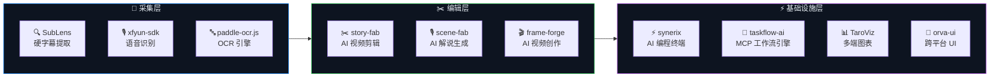

<!-- section:banner -->

  <picture>
    <source media="(prefers-color-scheme: dark)" srcset="assets/banner.svg" />
    
  </picture>

  
  

  

<!-- end:banner -->

---

<!-- section:about -->
## 👨‍💻 About Me

> **Full-Stack Developer**
>
> 聚焦跨平台桌面应用与视频处理工具链的开源开发。
> 技术栈以 **Rust**、**TypeScript**、**Python** 为核心，覆盖 Tauri 桌面端、AI 推理与全栈工程化。
> 作为 [Agions](https://github.com/Agions) GitHub 账号的维护者，致力于打造从视频采集、剪辑、字幕、解说到 AI 创作的全链路开源工具矩阵。

  

<!-- end:about -->

---

<!-- section:ecosystem -->
## 🏗️ The Agions Stack

我的开源项目构成了一套完整的 **AI 视频处理生态**，各工具在不同环节协同工作：

<table>
  <tr>
    <th align="center" width="20%">Layer</th>
    <th align="center" width="40%">Projects</th>
    <th align="center" width="40%">Tech</th>
  </tr>
  <tr>
    <td align="center"><b>📡 Capture</b> 内容采集</td>
    <td>
      <a href="https://github.com/Agions/SubLens"><code>SubLens</code></a> ·
      <a href="https://github.com/Agions/xfyun-sdk"><code>xfyun-sdk</code></a> ·
      <a href="https://github.com/Agions/paddle-ocr.js"><code>paddle-ocr.js</code></a>
    </td>
    <td>
      
      
      
    </td>
  </tr>
  <tr>
    <td align="center"><b>✂️ Edit</b> 智能编辑</td>
    <td>
      <a href="https://github.com/Agions/story-fab"><code>story-fab</code></a> ·
      <a href="https://github.com/Agions/scene-fab"><code>scene-fab</code></a> ·
      <a href="https://github.com/Agions/frame-forge"><code>frame-forge</code></a>
    </td>
    <td>
      
      
      
      
    </td>
  </tr>
  <tr>
    <td align="center"><b>⚡ Infra</b> 基础设施</td>
    <td>
      <a href="https://github.com/Agions/synerix"><code>synerix</code></a> ·
      <a href="https://github.com/Agions/taskflow-ai"><code>taskflow-ai</code></a> ·
      <a href="https://github.com/Agions/TaroViz"><code>TaroViz</code></a> ·
      <a href="https://github.com/Agions/orva-ui"><code>orva-ui</code></a>
    </td>
    <td>
      
      
      
      
    </td>
  </tr>
</table>
<!-- end:ecosystem -->

---

<!-- section:projects -->
## 🚀 Featured Projects

<!-- scene-fab — flagship -->

<b>🎙️ scene-fab</b> — AI 影视解说创作工具 <b>⭐ 295 · #1 by stars</b>

 

  
  
  
  
   
  <b>Python · Whisper · PyTorch · FFmpeg · PyQt6 · TTS</b>
   
  🏆 <b>298 stars</b> · 🍴 <b>55 forks</b> · 端到端视频解说自动生成管线：语音识别 → AI 剧本生成 → 语音合成 → 视频渲染。
  支持第一人称叙事、多语言配音、一键发布。
   
  <a href="https://github.com/Agions/scene-fab"><code>📂 查看源码 →</code></a>

<!-- story-fab -->

<b>✂️ story-fab</b> — AI 视频剪辑工作站 <b>⭐ 85</b>

 

  
  
  
  
   
  <b>Tauri · React · TypeScript · Rust · FFmpeg · Whisper</b>
   
  🏆 <b>85 stars</b> · 🍴 <b>23 forks</b> · 长视频智能拆条为爆款短片段。9:16/1:1/16:9 多格式输出，
  本地 Whisper 字幕识别，Rust 高性能渲染管线，无需上传云端。
   
  <a href="https://github.com/Agions/story-fab"><code>📂 查看源码 →</code></a>

<!-- frame-forge -->

<b>🎬 frame-forge</b> — AI 视频创作工作室 <b>⭐ 23</b>

 

  
  
  
  
   
  <b>TypeScript · AI · LLM · Computer Vision · Text-to-Video</b>
   
  🏆 <b>23 stars</b> · 🍴 <b>10 forks</b> · AI-Driven Video Creation Studio.
  多模型协同生成视频内容，支持脚本生成、语音合成、自动渲染输出。
   
  <a href="https://github.com/Agions/frame-forge"><code>📂 查看源码 →</code></a>

<!-- SubLens -->

<b>🔍 SubLens</b> — 专业硬字幕提取工具 <b>⭐ 15</b>

 

  
  
  
  
   
  <b>Tauri · Rust · Vue 3 · TypeScript · PaddleOCR</b>
   
  🏆 <b>15 stars</b> · 🍴 <b>3 forks</b> · 高性能桌面端字幕提取引擎。
  支持批量处理、多语言识别（中/英/日/韩）、SRT/ASS/VTT 多格式导出。
   
  <a href="https://github.com/Agions/SubLens"><code>📂 查看源码 →</code></a>

<!-- end:projects -->

---

<!-- section:libraries -->
## 📦 Developer Libraries

  <i>支撑上层应用的开源基础设施库</i>

<table>
  <tr>
    <th align="center" width="25%">Library</th>
    <th align="center" width="20%">Stars</th>
    <th align="center" width="30%">Description</th>
    <th align="center" width="25%">Tech Stack</th>
  </tr>
  <tr>
    <td><b>⚡ synerix</b></td>
    <td></td>
    <td>高性能 AI 编程终端 · 多智能体协作 + TUI + 沙箱</td>
    <td><code>Rust</code> <code>Ratatui</code> <code>MCP</code></td>
  </tr>
  <tr>
    <td><b>🔧 taskflow-ai</b></td>
    <td></td>
    <td>Pure MCP Server for Claude Desktop, Cursor & Windsurf</td>
    <td><code>TypeScript</code> <code>MCP</code></td>
  </tr>
  <tr>
    <td><b>📊 TaroViz</b></td>
    <td></td>
    <td>多端图表组件库，Taro + ECharts，支持小程序和 H5</td>
    <td><code>TypeScript</code> <code>Taro</code> <code>ECharts</code></td>
  </tr>
  <tr>
    <td><b>🎨 orva-ui</b></td>
    <td></td>
    <td>React/Taro 跨平台 UI 组件库，90+ 组件</td>
    <td><code>TypeScript</code> <code>React</code> <code>Taro</code></td>
  </tr>
  <tr>
    <td><b>🖨️ taro-bluetooth-print</b></td>
    <td></td>
    <td>Taro 蓝牙打印库，支持 ESC/POS、TSPL、ZPL、CPCL</td>
    <td><code>TypeScript</code> <code>Taro</code></td>
  </tr>
  <tr>
    <td><b>🎙️ xfyun-sdk</b></td>
    <td></td>
    <td>科大讯飞语音识别 WebAPI 的 JS/TS SDK</td>
    <td><code>TypeScript</code></td>
  </tr>
  <tr>
    <td><b>🔤 paddle-ocr.js</b></td>
    <td></td>
    <td>飞桨 PaddleOCR 的 JS 封装，浏览器和 Node.js</td>
    <td><code>TypeScript</code></td>
  </tr>
</table>
<!-- end:libraries -->

---

<!-- section:tech-stack -->
## 🛠️ Tech Radar

  点击 badge 导航到相关项目

  
  
  
  

| Category | Technologies | Powered Projects |
|----------|-------------|-----------------|
| 🖥️ **Desktop** | Tauri · Rust · Vue 3 · React · PyQt6 | SubLens · story-fab · scene-fab |
| 🌐 **Web / Mini-App** | TypeScript · React · Taro · NestJS · MongoDB | TaroViz · orva-ui · taro-bluetooth-print |
| 🧠 **AI / ML** | Python · PyTorch · Whisper · TTS · PaddleOCR | scene-fab · SubLens · paddle-ocr.js |
| 🔧 **Dev Tools** | Rust · Ratatui · MCP · Node.js · FFmpeg · Docker | synerix · taskflow-ai · xfyun-sdk |
| 🚀 **CI / DX** | GitHub Actions · Prettier · ESLint · Stylelint | All Projects |
<!-- end:tech-stack -->

---

<!-- section:analytics -->
## 📈 GitHub Analytics

  <picture>
    <source media="(prefers-color-scheme: dark)" srcset="https://github-readme-stats.vercel.app/api?username=Agions&show_icons=true&count_private=true&hide_border=true&bg_color=0d1117&title_color=0A84FF&icon_color=30D158&text_color=e6edf3&ring_color=0A84FF&include_all_commits=true&custom_title=Agions·GitHub+Stats" />
    
  </picture>
  <picture>
    <source media="(prefers-color-scheme: dark)" srcset="https://github-readme-stats.vercel.app/api/top-langs/?username=Agions&layout=compact&hide_border=true&bg_color=0d1117&title_color=0A84FF&text_color=e6edf3&langs_count=6" />
    
  </picture>

  

<!-- end:analytics -->

---

<!-- section:activity -->
## 🌊 Contribution Activity

  <picture>
    <source media="(prefers-color-scheme: dark)" srcset="https://github-readme-activity-graph.vercel.app/graph?username=Agions&theme=react-dark&hide_border=true&bg_color=0d1117&color=0A84FF&line=30D158&point=BF5AF2&custom_title=Agions·Contribution+Graph" />
    
  </picture>

  <picture>
    <source media="(prefers-color-scheme: dark)" srcset="https://raw.githubusercontent.com/Agions/Agions/main/output/snake.svg" />
    
  </picture>

  
  
  
  

<!-- end:activity -->

---

<!-- section:contact -->
## 📬 Let's Connect

  
   
  📱 WeChat 公众号

  💬 反馈与建议 · 开源合作 · 项目交流

<!-- end:contact -->

---

<!-- section:footer -->

  

  ⚡ Agions · Building the next generation of video tools · Since 2017

<!-- end:footer -->