  

---

  
  
  
  

---

## ✨ About Me

**专注跨平台桌面应用与 AI 音视频工具的全栈开发者**

**技术栈：** Tauri · Rust · Python · TypeScript · Vue 3 · React · FFmpeg · Whisper

**所在地：** Hangzhou, China

---

## 🚀 Projects

**Narrafiilm** · AI 第一人称视频解说生成器
`PyQt6` `Whisper` `FFmpeg` `Python`
⭐ 57 · [View →](https://github.com/Agions/Narrafiilm)

---

**CutDeck** · 开源 AI 视频剪辑工具
`Tauri` `Rust` `Vue 3` `Vue 3` `TypeScript`
⭐ 28 · [View →](https://github.com/Agions/CutDeck)

---

**ManGaAI** · AI 漫剧视频创作平台
`Taro` `React` `Python` `Whisper`
⭐ 8 · [View →](https://github.com/Agions/ManGaAI)

---

**HardSubX** · 专业硬字幕提取工具
`Tauri` `Rust` `Vue 3` `TypeScript` `PaddleOCR`
⭐ 128 · [View →](https://github.com/Agions/HardSubX)

---

**taro-bluetooth-print** · 微信小程序蓝牙打印 SDK
`Taro` `TypeScript` `微信小程序` `蓝牙 BLE`
⭐ 162 · [View →](https://github.com/Agions/taro-bluetooth-print)

---

## 🛠 Tech Stack

---

---

  

---

  
  
微信公众号 · WeChat

