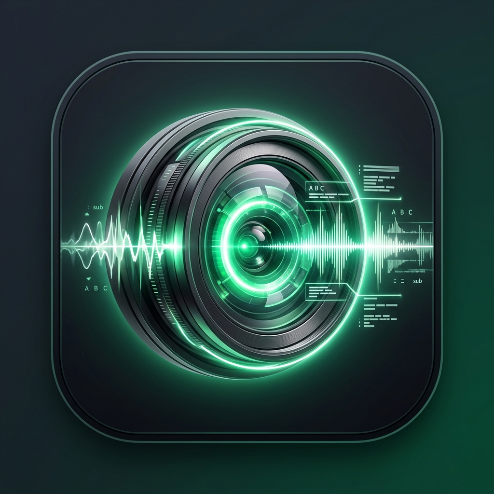

<!-- section:banner -->

  

  
  
  

  

<!-- end:banner -->

---

<!-- section:about -->
## 👨‍💻 About Me

> **Full-Stack Developer & Audio/Video Architect**
>
> 聚焦跨平台桌面应用与音视频/AI处理工具链的开源开发。
> 技术栈以 **Rust**、**TypeScript**、**Python** 为核心，覆盖 Tauri 2.0 桌面端、AI 推理与全栈工程化。
> 作为 [Agions](https://github.com/Agions) GitHub 账号的维护者，致力于打造从视频采集、AI 漫剧、硬字幕提取到全自动解说创作的下一代开源工具矩阵。

  

<!-- end:about -->

---

<!-- section:projects -->
## 🚀 Featured Projects

<!-- Card 1: Vynaro -->
<table width="100%" style="border-collapse: collapse; border: 1px solid #30363d; border-radius: 12px; background-color: #0d1117; margin-bottom: 20px;">
  <tr>
    <td style="padding: 18px;">
      

        <h3 style="margin: 0; display: inline-flex; align-items: center;">
          
          <a href="https://github.com/Agions/vynaro" style="color: #58a6ff; text-decoration: none;">Vynaro (叙影 AI)</a>
        </h3>
        ⭐ 337 · #1 Flagship
      

      

        下一代 7 步全自动 AI 影视解说与第一人称视频创作工具 (Tauri 2 + Rust + React 19)
      

      

        
        
        
        
      

      

        ⚡ <b>端到端视频生成管线</b>：语音识别 → AI 剧本生成 → 多角色语音合成 → 智能对齐字幕 → 4K 视频渲染。
      

      

        

          <code style="background: #161b22; color: #79c0ff; border: 1px solid #30363d; padding: 3px 8px; border-radius: 6px; font-size: 11px;">Tauri 2</code>
          <code style="background: #161b22; color: #e3b341; border: 1px solid #30363d; padding: 3px 8px; border-radius: 6px; font-size: 11px;">Rust</code>
          <code style="background: #161b22; color: #61dafb; border: 1px solid #30363d; padding: 3px 8px; border-radius: 6px; font-size: 11px;">React 19</code>
          <code style="background: #161b22; color: #ff6f00; border: 1px solid #30363d; padding: 3px 8px; border-radius: 6px; font-size: 11px;">Whisper</code>
          <code style="background: #161b22; color: #00d4aa; border: 1px solid #30363d; padding: 3px 8px; border-radius: 6px; font-size: 11px;">FFmpeg</code>
        

        <a href="https://github.com/Agions/vynaro" style="color: #38bdf8; text-decoration: none; font-weight: 600; font-size: 13px;"><code>📂 查看源码 →</code></a>
      

    </td>
  </tr>
</table>

<!-- Card 2: MangaV -->
<table width="100%" style="border-collapse: collapse; border: 1px solid #30363d; border-radius: 12px; background-color: #0d1117; margin-bottom: 20px;">
  <tr>
    <td style="padding: 18px;">
      

        <h3 style="margin: 0; display: inline-flex; align-items: center;">
          
          <a href="https://github.com/Agions/mangav" style="color: #58a6ff; text-decoration: none;">MangaV (漫织 AI)</a>
        </h3>
        ⭐ 70 · AI Manga
      

      

        端到端 AI 漫剧创作平台 (Tauri + Rust + TypeScript + AI Multimodal)
      

      

        
        
        
        
      

      

        🎨 <b>多模型协同生成</b>：集成 13 大 AI 大模型与 FFmpeg 硬件加速，输入一本小说自动生成 4K 精致漫剧分镜与合成视频。
      

      

        

          <code style="background: #161b22; color: #3178c6; border: 1px solid #30363d; padding: 3px 8px; border-radius: 6px; font-size: 11px;">TypeScript</code>
          <code style="background: #161b22; color: #ffc131; border: 1px solid #30363d; padding: 3px 8px; border-radius: 6px; font-size: 11px;">Tauri</code>
          <code style="background: #161b22; color: #e3b341; border: 1px solid #30363d; padding: 3px 8px; border-radius: 6px; font-size: 11px;">Rust</code>
          <code style="background: #161b22; color: #a371f7; border: 1px solid #30363d; padding: 3px 8px; border-radius: 6px; font-size: 11px;">LLM</code>
          <code style="background: #161b22; color: #00d4aa; border: 1px solid #30363d; padding: 3px 8px; border-radius: 6px; font-size: 11px;">Computer Vision</code>
        

        <a href="https://github.com/Agions/mangav" style="color: #38bdf8; text-decoration: none; font-weight: 600; font-size: 13px;"><code>📂 查看源码 →</code></a>
      

    </td>
  </tr>
</table>

<!-- Card 3: CaptionFab -->
<table width="100%" style="border-collapse: collapse; border: 1px solid #30363d; border-radius: 12px; background-color: #0d1117; margin-bottom: 20px;">
  <tr>
    <td style="padding: 18px;">
      

        <h3 style="margin: 0; display: inline-flex; align-items: center;">
          
          <a href="https://github.com/Agions/caption-fab" style="color: #58a6ff; text-decoration: none;">CaptionFab</a>
        </h3>
        ⭐ 21 · Subtitle OCR
      

      

        专业硬编码字幕提取工具 (Tauri + Vue 3 + Rust + PaddleOCR)
      

      

        
        
        
        
      

      

        🔍 <b>高性能硬字幕提取</b>：支持批量处理、多语言识别（中/英/日/韩）与 SRT/ASS/VTT 多格式精准导出。
      

      

        

          <code style="background: #161b22; color: #ffc131; border: 1px solid #30363d; padding: 3px 8px; border-radius: 6px; font-size: 11px;">Tauri</code>
          <code style="background: #161b22; color: #e3b341; border: 1px solid #30363d; padding: 3px 8px; border-radius: 6px; font-size: 11px;">Rust</code>
          <code style="background: #161b22; color: #4fc08d; border: 1px solid #30363d; padding: 3px 8px; border-radius: 6px; font-size: 11px;">Vue 3</code>
          <code style="background: #161b22; color: #3178c6; border: 1px solid #30363d; padding: 3px 8px; border-radius: 6px; font-size: 11px;">TypeScript</code>
          <code style="background: #161b22; color: #f05138; border: 1px solid #30363d; padding: 3px 8px; border-radius: 6px; font-size: 11px;">PaddleOCR</code>
        

        <a href="https://github.com/Agions/caption-fab" style="color: #38bdf8; text-decoration: none; font-weight: 600; font-size: 13px;"><code>📂 查看源码 →</code></a>
      

    </td>
  </tr>
</table>
<!-- end:projects -->

---

<!-- section:tech-stack -->
## 🛠️ Tech Radar

  点击 badge 导航到相关项目

  
  
  
  

| Category | Technologies | Powered Projects |
|----------|-------------|-----------------|
| 🖥️ **Desktop** | Tauri 2.0 · Rust · React 19 · Vue 3 · TypeScript | vynaro · mangav · caption-fab |
| 🧠 **AI / ML** | Python · PyTorch · Whisper · TTS · PaddleOCR | vynaro · caption-fab · mangav |
| 🎬 **Video / Manga** | FFmpeg · Computer Vision · LLM · Storyboard AI | vynaro · mangav |
| 🔧 **Dev Tools** | TypeScript · Rust · Node.js · GitHub Actions | All Projects |
<!-- end:tech-stack -->

---

<!-- section:game -->
<!-- end:game -->

---

<!-- section:activity -->
## 🌊 Contribution Activity

  <picture>
    <source media="(prefers-color-scheme: dark)" srcset="https://github-readme-activity-graph.vercel.app/graph?username=Agions&theme=react-dark&hide_border=true&bg_color=0d1117&color=0A84FF&line=30D158&point=BF5AF2&custom_title=Agions·Contribution+Graph" />
    
  </picture>

  <picture>
    <source media="(prefers-color-scheme: dark)" srcset="https://raw.githubusercontent.com/Agions/Agions/main/output/snake.svg" />
    
  </picture>

  
  
  
  

  
  
  

<!-- end:activity -->

---

<!-- section:contact -->
## 📬 Let's Connect

  
   
  📱 WeChat 公众号

  💬 反馈与建议 · 开源合作 · 项目交流

<!-- end:contact -->

---

<!-- section:footer -->

  

  ⚡ Agions · Building the next generation of video tools · Since 2017

<!-- end:footer -->