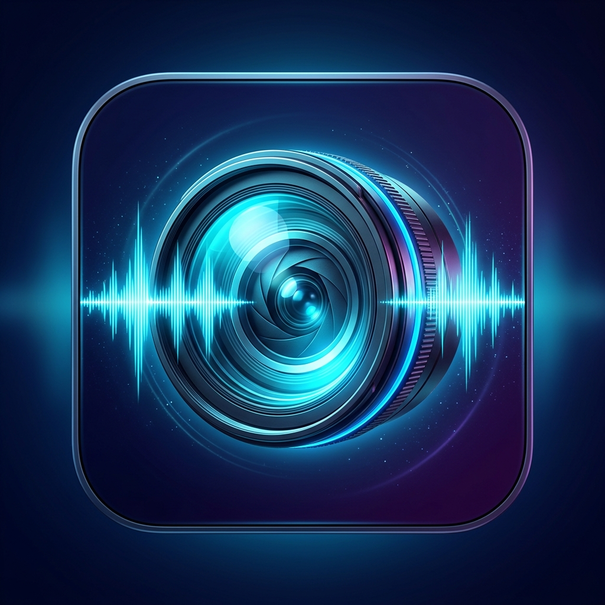
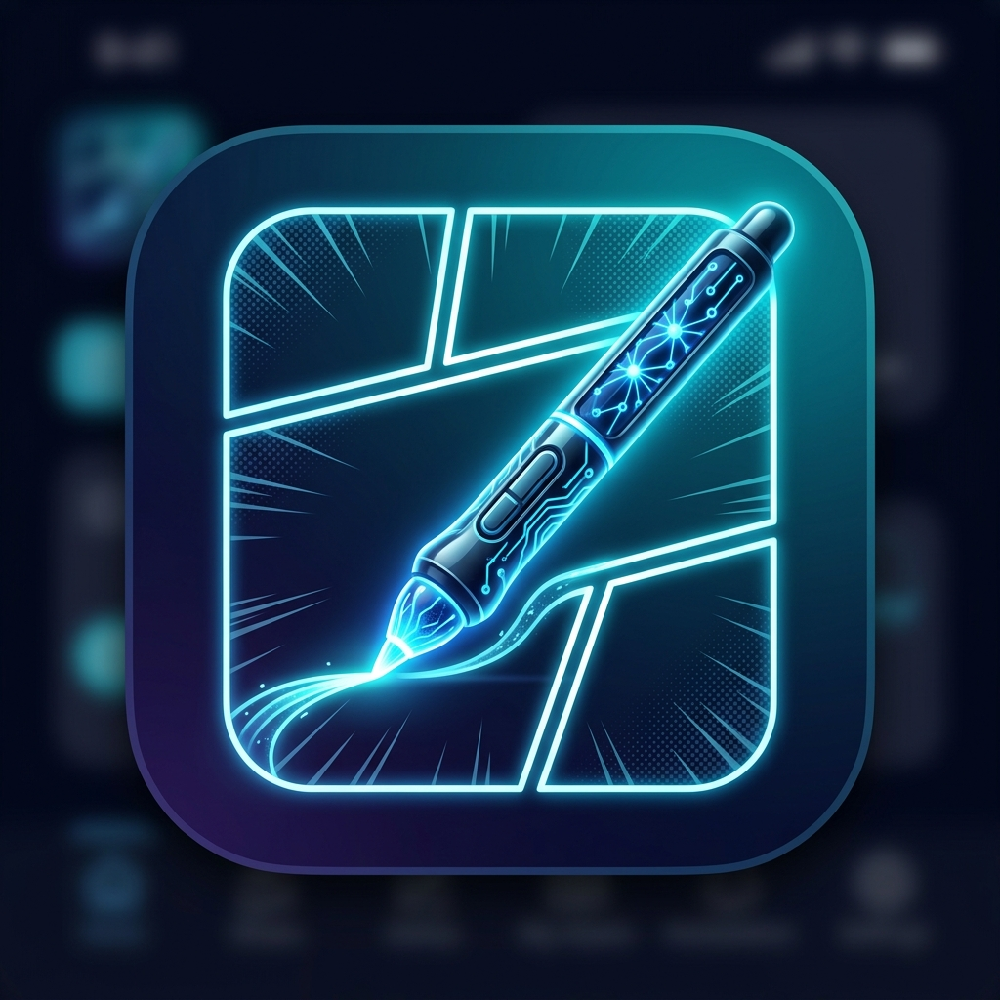

<!-- section:banner -->

  

  
  
  
  

<!-- end:banner -->

---

<!-- section:about -->
## 👨‍💻 About Me

> **Full-Stack Developer · Desktop & AI Video Toolchain Architect**
>
> 专注跨平台桌面应用与音视频 AI 工具链的开源工程实践。核心技术栈：**Rust · TypeScript · Python**，覆盖 Tauri 2.0 桌面端、AI 推理、TUI 终端工具与全栈工程化。
> 维护 [Agions](https://github.com/Agions) 账号，致力于打造从 AI 影视解说、漫剧创作、字幕蒸馏提取到本地 AI 编程代理的下一代开源工具矩阵。

  

<!-- end:about -->

---

<!-- section:projects -->
## 🚀 Featured Projects

<!-- Card 1: Vynaro -->
<table width="100%" style="width:100%; border-collapse:collapse; margin-bottom:14px;">
  <tr>
    <td width="100%" style="width:100%; padding:18px 20px; background:#0d1117; border:1px solid #21262d; border-radius:12px; vertical-align:top;">
      <table width="100%" style="width:100%; border-collapse:collapse; margin-bottom:10px;">
        <tr>
          <td>
            <h3 style="margin:0; font-size:16px;">
              <a href="https://github.com/Agions/vynaro" style="color:#58a6ff; text-decoration:none;">Vynaro</a> 叙影 AI
            </h3>
          </td>
          <td align="right">
            ⭐ 337 &nbsp;·&nbsp; #1 Flagship
          </td>
        </tr>
      </table>
      

        下一代 7 步全自动 AI 影视解说与第一人称视频创作工具 · Tauri 2 · Rust · React 19
      

      

        
        
        
        
      

      

        ⚡ 语音识别 → AI 剧本生成 → 多角色 TTS 语音合成 → 字幕精准对齐 → 4K 高清视频自动渲染，全流程本地端到端处理，无需上传云端。
      

      <table width="100%" style="width:100%; border-collapse:collapse;">
        <tr>
          <td>
            <code style="background:#161b22; color:#79c0ff; border:1px solid #30363d; padding:2px 8px; border-radius:5px; font-size:11px;">Tauri 2</code>
            <code style="background:#161b22; color:#e3b341; border:1px solid #30363d; padding:2px 8px; border-radius:5px; font-size:11px;">Rust</code>
            <code style="background:#161b22; color:#61dafb; border:1px solid #30363d; padding:2px 8px; border-radius:5px; font-size:11px;">React 19</code>
            <code style="background:#161b22; color:#ff9500; border:1px solid #30363d; padding:2px 8px; border-radius:5px; font-size:11px;">Whisper</code>
            <code style="background:#161b22; color:#00d4aa; border:1px solid #30363d; padding:2px 8px; border-radius:5px; font-size:11px;">FFmpeg</code>
          </td>
          <td align="right">
            <a href="https://github.com/Agions/vynaro" style="color:#58a6ff; font-size:13px; font-weight:500; text-decoration:none;">View Source →</a>
          </td>
        </tr>
      </table>
    </td>
  </tr>
</table>

<!-- Card 2: MangaV -->
<table width="100%" style="width:100%; border-collapse:collapse; margin-bottom:14px;">
  <tr>
    <td width="100%" style="width:100%; padding:18px 20px; background:#0d1117; border:1px solid #21262d; border-radius:12px; vertical-align:top;">
      <table width="100%" style="width:100%; border-collapse:collapse; margin-bottom:10px;">
        <tr>
          <td>
            <h3 style="margin:0; font-size:16px;">
              <a href="https://github.com/Agions/mangav" style="color:#58a6ff; text-decoration:none;">MangaV</a> 漫织 AI
            </h3>
          </td>
          <td align="right">
            ⭐ 70 &nbsp;·&nbsp; AI Manga
          </td>
        </tr>
      </table>
      

        端到端 AI 漫剧与数字绘本自动创作平台 · Tauri · Rust · TypeScript · Multimodal AI
      

      

        
        
        
        
      

      

        🎨 集成 13 大 AI 大模型与 FFmpeg 硬件加速引擎，输入小说一键生成 4K 精致漫剧分镜与动态合成视频。
      

      <table width="100%" style="width:100%; border-collapse:collapse;">
        <tr>
          <td>
            <code style="background:#161b22; color:#3178c6; border:1px solid #30363d; padding:2px 8px; border-radius:5px; font-size:11px;">TypeScript</code>
            <code style="background:#161b22; color:#ffc131; border:1px solid #30363d; padding:2px 8px; border-radius:5px; font-size:11px;">Tauri 2</code>
            <code style="background:#161b22; color:#e3b341; border:1px solid #30363d; padding:2px 8px; border-radius:5px; font-size:11px;">Rust</code>
            <code style="background:#161b22; color:#a371f7; border:1px solid #30363d; padding:2px 8px; border-radius:5px; font-size:11px;">LLM</code>
            <code style="background:#161b22; color:#00d4aa; border:1px solid #30363d; padding:2px 8px; border-radius:5px; font-size:11px;">FFmpeg</code>
          </td>
          <td align="right">
            <a href="https://github.com/Agions/mangav" style="color:#58a6ff; font-size:13px; font-weight:500; text-decoration:none;">View Source →</a>
          </td>
        </tr>
      </table>
    </td>
  </tr>
</table>

<!-- Card 3: Distill -->
<table width="100%" style="width:100%; border-collapse:collapse; margin-bottom:14px;">
  <tr>
    <td width="100%" style="width:100%; padding:18px 20px; background:#0d1117; border:1px solid #21262d; border-radius:12px; vertical-align:top;">
      <table width="100%" style="width:100%; border-collapse:collapse; margin-bottom:10px;">
        <tr>
          <td>
            <h3 style="margin:0; font-size:16px;">
              <a href="https://github.com/Agions/Distill" style="color:#58a6ff; text-decoration:none;">Distill</a> 字幕蒸馏
            </h3>
          </td>
          <td align="right">
            ⭐ 21 &nbsp;·&nbsp; Subtitle OCR
          </td>
        </tr>
      </table>
      

        专业视频硬字幕提取与蒸馏工具，支持离线与云端双模式 · Tauri · Vue 3 · Rust · PaddleOCR
      

      

        
        
        
        
      

      

        🔍 高性能桌面端硬字幕精准提取引擎，支持批量处理、多语言 OCR 识别（中/英/日/韩）与 SRT/ASS/VTT 多格式导出。
      

      <table width="100%" style="width:100%; border-collapse:collapse;">
        <tr>
          <td>
            <code style="background:#161b22; color:#ffc131; border:1px solid #30363d; padding:2px 8px; border-radius:5px; font-size:11px;">Tauri</code>
            <code style="background:#161b22; color:#e3b341; border:1px solid #30363d; padding:2px 8px; border-radius:5px; font-size:11px;">Rust</code>
            <code style="background:#161b22; color:#4fc08d; border:1px solid #30363d; padding:2px 8px; border-radius:5px; font-size:11px;">Vue 3</code>
            <code style="background:#161b22; color:#3178c6; border:1px solid #30363d; padding:2px 8px; border-radius:5px; font-size:11px;">TypeScript</code>
            <code style="background:#161b22; color:#f05138; border:1px solid #30363d; padding:2px 8px; border-radius:5px; font-size:11px;">PaddleOCR</code>
          </td>
          <td align="right">
            <a href="https://github.com/Agions/Distill" style="color:#58a6ff; font-size:13px; font-weight:500; text-decoration:none;">View Source →</a>
          </td>
        </tr>
      </table>
    </td>
  </tr>
</table>

<!-- end:projects -->

---

<!-- section:tech-stack -->
<!-- end:tech-stack -->

---

<!-- section:game -->
<!-- end:game -->

---

<!-- section:activity -->
## 🌊 Contribution Activity

  <picture>
    <source media="(prefers-color-scheme: dark)" srcset="https://github-readme-activity-graph.vercel.app/graph?username=Agions&theme=react-dark&hide_border=true&bg_color=0d1117&color=0A84FF&line=30D158&point=BF5AF2&custom_title=Agions+·+Contribution+Graph" />
    
  </picture>

  <picture>
    <source media="(prefers-color-scheme: dark)" srcset="https://raw.githubusercontent.com/Agions/Agions/main/output/snake.svg" />
    
  </picture>

  
  
  
  
  

<!-- end:activity -->

---

<!-- section:contact -->
## 📬 Let's Connect

  
   
  📱 WeChat 公众号

  💬 开源合作 · 项目交流 · 反馈与建议

<!-- end:contact -->

---

<!-- section:footer -->

  ⚡ Agions · Building the next generation of AI-native video & developer tools · Since 2017

<!-- end:footer -->